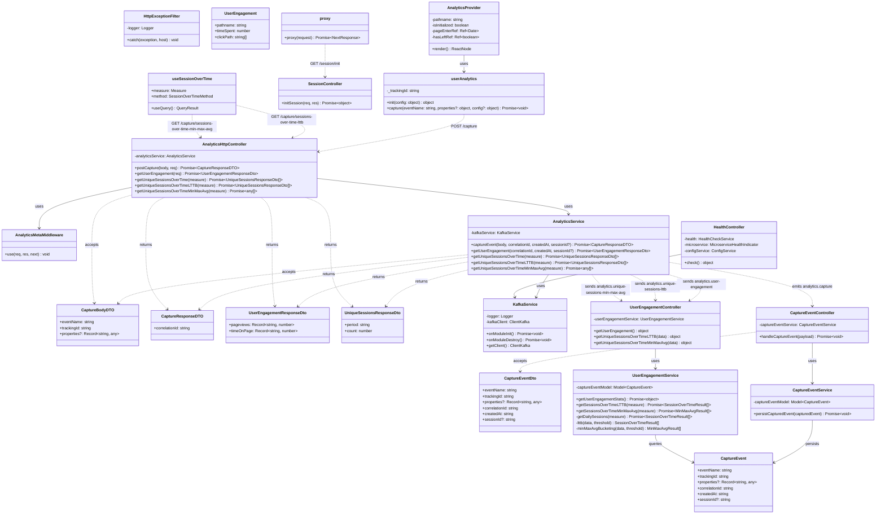

# Architecture — Class Diagram

```mermaid
classDiagram

    %% ─────────────────────────────────────────
    %% packages/user-analytics-sdk
    %% ─────────────────────────────────────────
    class userAnalytics {
        -_trackingId: string
        +init(config: object) object
        +capture(eventName: string, properties?: object, config?: object) Promise~void~
    }

    %% ─────────────────────────────────────────
    %% apps/analytics-api — DTOs
    %% ─────────────────────────────────────────
    class CaptureBodyDTO {
        +eventName: string
        +trackingId: string
        +properties?: Record~string, any~
    }

    class CaptureResponseDTO {
        +correlationId: string
    }

    class UserEngagementResponseDto {
        +pageviews: Record~string, number~
        +timeOnPage: Record~string, number~
    }

    class UniqueSessionsResponseDto {
        +period: string
        +count: number
    }

    %% ─────────────────────────────────────────
    %% apps/analytics-api — Middleware / Filter
    %% ─────────────────────────────────────────
    class AnalyticsMetaMiddleware {
        +use(req, res, next) void
    }

    class HttpExceptionFilter {
        -logger: Logger
        +catch(exception, host) void
    }

    %% ─────────────────────────────────────────
    %% apps/analytics-api — Services
    %% ─────────────────────────────────────────
    class KafkaService {
        -logger: Logger
        -kafkaClient: ClientKafka
        +onModuleInit() Promise~void~
        +onModuleDestroy() Promise~void~
        +getClient() ClientKafka
    }

    class AnalyticsService {
        -kafkaService: KafkaService
        +captureEvent(body, correlationId, createdAt, sessionId?) Promise~CaptureResponseDTO~
        +getUserEngagement(correlationId, createdAt, sessionId?) Promise~UserEngagementResponseDto~
        +getUniqueSessionsOverTime(measure) Promise~UniqueSessionsResponseDto[]~
        +getUniqueSessionsOverTimeLTTB(measure) Promise~UniqueSessionsResponseDto[]~
        +getUniqueSessionsOverTimeMinMaxAvg(measure) Promise~any[]~
    }

    %% ─────────────────────────────────────────
    %% apps/analytics-api — Controllers
    %% ─────────────────────────────────────────
    class AnalyticsHttpController {
        -analyticsService: AnalyticsService
        +postCapture(body, req) Promise~CaptureResponseDTO~
        +getUserEngagement(req) Promise~UserEngagementResponseDto~
        +getUniqueSessionsOverTime(measure) Promise~UniqueSessionsResponseDto[]~
        +getUniqueSessionsOverTimeLTTB(measure) Promise~UniqueSessionsResponseDto[]~
        +getUniqueSessionsOverTimeMinMaxAvg(measure) Promise~any[]~
    }

    class HealthController {
        -health: HealthCheckService
        -microservice: MicroserviceHealthIndicator
        -configService: ConfigService
        +check() object
    }

    class SessionController {
        +initSession(req, res) Promise~object~
    }

    %% ─────────────────────────────────────────
    %% apps/analytics-core — DTOs & Schemas
    %% ─────────────────────────────────────────
    class CaptureEventDto {
        +eventName: string
        +trackingId: string
        +properties?: Record~string, any~
        +correlationId: string
        +createdAt: string
        +sessionId?: string
    }

    class CaptureEvent {
        +eventName: string
        +trackingId: string
        +properties?: Record~string, any~
        +correlationId: string
        +createdAt: string
        +sessionId?: string
    }

    class UserEngagement {
        +pathname: string
        +timeSpent: number
        +clickPath: string[]
    }

    %% ─────────────────────────────────────────
    %% apps/analytics-core — Services
    %% ─────────────────────────────────────────
    class CaptureEventService {
        -captureEventModel: Model~CaptureEvent~
        +persistCapturedEvent(capturedEvent) Promise~void~
    }

    class UserEngagementService {
        -captureEventModel: Model~CaptureEvent~
        +getUserEngagementStats() Promise~object~
        +getSessionsOverTimeLTTB(measure) Promise~SessionOverTimeResult[]~
        +getSessionsOverTimeMinMaxAvg(measure) Promise~MinMaxAvgResult[]~
        -getDailySessions(measure) Promise~SessionOverTimeResult[]~
        -lttb(data, threshold) SessionOverTimeResult[]
        -minMaxAvgBucketing(data, threshold) MinMaxAvgResult[]
    }

    %% ─────────────────────────────────────────
    %% apps/analytics-core — Controllers
    %% ─────────────────────────────────────────
    class CaptureEventController {
        -captureEventService: CaptureEventService
        +handleCaptureEvent(payload) Promise~void~
    }

    class UserEngagementController {
        -userEngagementService: UserEngagementService
        +getUserEngagement() object
        +getUniqueSessionsOverTimeLTTB(data) object
        +getUniqueSessionsOverTimeMinMaxAvg(data) object
    }

    %% ─────────────────────────────────────────
    %% apps/analytics-dashboard
    %% ─────────────────────────────────────────
    class useSessionOverTime {
        +measure: Measure
        +method: SessionOverTimeMethod
        +useQuery() QueryResult
    }

    %% ─────────────────────────────────────────
    %% apps/tester-ui
    %% ─────────────────────────────────────────
    class AnalyticsProvider {
        -pathname: string
        -isInitialized: boolean
        -pageEnterRef: Ref~Date~
        -hasLeftRef: Ref~boolean~
        +render() ReactNode
    }

    class proxy {
        +proxy(request) Promise~NextResponse~
    }

    %% ─────────────────────────────────────────
    %% Relationships
    %% ─────────────────────────────────────────

    %% analytics-api internal
    AnalyticsService --> KafkaService : uses
    AnalyticsService ..> CaptureBodyDTO : accepts
    AnalyticsService ..> CaptureResponseDTO : returns
    AnalyticsService ..> UserEngagementResponseDto : returns
    AnalyticsService ..> UniqueSessionsResponseDto : returns
    AnalyticsHttpController --> AnalyticsService : uses
    AnalyticsHttpController ..> CaptureBodyDTO : accepts
    AnalyticsHttpController ..> CaptureResponseDTO : returns
    AnalyticsHttpController ..> UserEngagementResponseDto : returns
    AnalyticsHttpController ..> UniqueSessionsResponseDto : returns
    AnalyticsHttpController --> AnalyticsMetaMiddleware : uses
    HealthController --> KafkaService : pings via health check

    %% analytics-core internal
    CaptureEventController --> CaptureEventService : uses
    CaptureEventController ..> CaptureEventDto : accepts
    CaptureEventService --> CaptureEvent : persists
    UserEngagementController --> UserEngagementService : uses
    UserEngagementService --> CaptureEvent : queries

    %% cross-app: analytics-api → analytics-core (via Kafka)
    AnalyticsService ..> CaptureEventController : emits analytics.capture
    AnalyticsService ..> UserEngagementController : sends analytics.user-engagement
    AnalyticsService ..> UserEngagementController : sends analytics.unique-sessions-lttb
    AnalyticsService ..> UserEngagementController : sends analytics.unique-sessions-min-max-avg

    %% tester-ui → SDK → analytics-api
    AnalyticsProvider --> userAnalytics : uses
    userAnalytics ..> AnalyticsHttpController : POST /capture

    %% tester-ui proxy → analytics-api session
    proxy ..> SessionController : GET /session/init

    %% analytics-dashboard → analytics-api
    useSessionOverTime ..> AnalyticsHttpController : GET /capture/sessions-over-time-lttb
    useSessionOverTime ..> AnalyticsHttpController : GET /capture/sessions-over-time-min-max-avg
```
